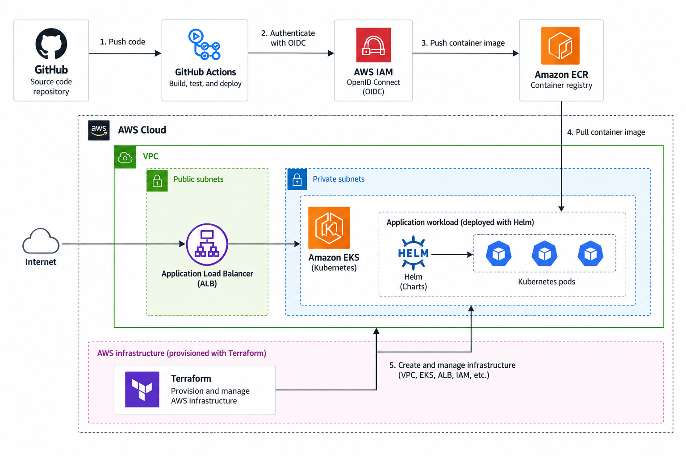

# AWS HA Secure Web Application

A portfolio cloud/platform engineering project demonstrating how a small
FastAPI application can be packaged, validated, and prepared for deployment
to AWS using Terraform, Kubernetes, Helm, Amazon ECR, Amazon EKS, and
GitHub Actions.

The project emphasizes reproducibility, clear configuration ownership,
least-privilege CI authentication, infrastructure validation, and
cost-conscious operation rather than keeping an expensive demonstration
environment running continuously.

## What This Project Demonstrates

- Infrastructure as Code with Terraform
- AWS VPC and Amazon EKS infrastructure
- Containerized FastAPI application
- Helm-based Kubernetes workload deployment
- Kubernetes readiness and liveness probes
- Horizontal Pod Autoscaling
- GitHub Actions CI quality gates
- AWS authentication from GitHub using OIDC
- Amazon ECR image publishing using Git commit SHA tags
- Terraform provider dependency locking
- Reproducible local application startup
- Separation of infrastructure, workload, and CI responsibilities
- Cost-aware lifecycle management for cloud resources

## Architecture



The project is designed around three primary ownership boundaries:

```text
Terraform
    │
    └── AWS infrastructure

Helm
    │
    └── Kubernetes application workload

GitHub Actions
    │
    └── validation and container publishing
```

The AWS environment uses the us-east-2 region.

### Configuration Ownership

The repository intentionally keeps each operational responsibility in one
authoritative location.

Responsibility	Source of Truth

AWS infrastructure	terraform/
EKS infrastructure	terraform/eks/
ECR infrastructure	terraform/ecr/
Kubernetes application workload	platform/helm/golden-web-service/
Application dependencies	requirements.txt
CI validation and image publishing	.github/workflows/ci-publish.yml
Project lifecycle guidance	runbooks/PROJECT_LIFECYCLE.md


This prevents historical experiments or duplicate configuration from becoming
competing deployment paths.

## Run Locally

The application can be run locally without provisioning AWS resources.
Prerequisites
- Python 3.12
- Git

## Create a virtual environment
```powershell
python -m venv .venv
.venv\Scripts\activate
```

## Install dependencies
```powershell
pip install -r requirements.txt
```

### Start the application
```powershell
python -m uvicorn app.main:app --host 127.0.0.1 --port 8000
```

### Verify the health endpoint
```powershell
curl http://127.0.0.1:8000/health
```
Expected response:
{"status":"healthy"}


The local application is then available at:
- / — application home page
- /health — health endpoint
- /game — number guessing application

### Repository Validation

The repository can be validated without provisioning AWS infrastructure.

### Terraform formatting
```powershell
terraform fmt -check -recursive terraform
```

### Terraform validation

Root infrastructure:
```powershell
terraform -chdir=terraform init -backend=false -input=false -lockfile=readonly
terraform -chdir=terraform validate
```

ECR infrastructure:
```powershell
terraform -chdir=terraform/ecr init -backend=false -input=false -lockfile=readonly
terraform -chdir=terraform/ecr validate
```

EKS infrastructure:
```powershell
terraform -chdir=terraform/eks init -backend=false -input=false -lockfile=readonly
terraform -chdir=terraform/eks validate
```

The committed .terraform.lock.hcl files provide deterministic provider
selection and allow CI to use the same dependency decisions as local
development.

Helm validation
```powershell
helm lint platform\helm\golden-web-service
```

Render the Kubernetes manifests without deploying them:
```powershell
helm template aws-ha-webapp platform\helm\golden-web-service > NUL
```

### Container validation

The Docker image is built automatically by GitHub Actions as part of the CI
quality gate.

A pull request must successfully complete:

Terraform validation
        │
Container build
        │
Helm validation
        │
        ▼
      PASS

Only validated changes merged to main are eligible for the publishing stage.

CI/CD
GitHub Actions provides separate validation and publishing responsibilities.

Pull requests run:
- Terraform formatting and validation
- Container build validation
- Helm linting and template rendering

Publishing occurs only after changes reach main and all required validation
jobs have succeeded.

GitHub authenticates to AWS using OpenID Connect (OIDC), so long-lived AWS
access keys are not stored in GitHub.

The publishing job receives the AWS identity permission required to obtain
temporary credentials; validation jobs do not require AWS authentication.

Container images published to Amazon ECR are tagged using the Git commit SHA,
allowing an image to be traced back to the source revision that produced it.

### Kubernetes Workload

The supported Kubernetes workload is defined by the Helm chart:
platform/helm/golden-web-service/

The chart provides:
- Deployment
- ClusterIP Service
- Horizontal Pod Autoscaler
- Readiness probe
- Liveness probe
- Optional ALB Ingress
- Optional External Secret support
- ServiceAccount configuration
- CPU and memory requests and limits

Historical raw Kubernetes deployment manifests were retired after the required
behavior was incorporated into the Helm chart.

### Security and Reliability

<<<<<<< HEAD
The project demonstrates several security and reliability practices:

- GitHub Actions uses AWS OIDC rather than long-lived credentials.
- AWS identity permissions are limited to the jobs that require them.
- The application container runs as a non-root user.
- Kubernetes workloads define CPU and memory requests and limits.
- Kubernetes readiness and liveness probes use /health.
- Horizontal Pod Autoscaling is supported through the Helm chart.
- Terraform state files and local Terraform working directories are excluded
  from source control.
- Terraform provider versions are constrained and dependency selections are
  committed through lock files.
- AWS infrastructure and Kubernetes workload configuration have separate
  ownership boundaries.

### Repository Structure
```
.
├── .github/
│   └── workflows/
│       └── ci-publish.yml
│
├── app/
│   └── main.py
│
├── diagrams/
│   └── github-to-aws-eks-cicd-architecture.png
│
├── platform/
│   ├── examples/
│   └── helm/
│       └── golden-web-service/
│
├── runbooks/
│   └── PROJECT_LIFECYCLE.md
│
├── terraform/
│   ├── ecr/
│   └── eks/
│
├── Dockerfile
├── requirements.txt
└── README.md
```

### Cost and Lifecycle

The AWS environment is intentionally not kept running continuously.
Amazon EKS, worker nodes, load balancers, networking components, and other
managed AWS services may generate ongoing charges while deployed. Local
application execution and CI configuration validation are therefore the
preferred review path.
Creating AWS infrastructure is not required to review or validate this project.

### Before provisioning infrastructure:

1. Review the Terraform configuration.
2. Run terraform plan.
3. Review the expected resources and potential cost.
4. Apply infrastructure only when a live demonstration environment is needed.
5. Review infrastructure again before destroying resources.

See:
runbooks/PROJECT_LIFECYCLE.md

for lifecycle and validation guidance.

### Deployment Status

The cloud environment should be considered ephemeral rather than permanently
hosted.
The repository is intended to demonstrate a reproducible architecture and
engineering workflow without requiring the associated AWS resources to remain
online continuously.
As a result, public application endpoints referenced in project history may not
currently be available.
Current Scope
This repository represents the current supported implementation of the project.

Earlier iterations explored additional capabilities including:
- Blue/green deployment using Argo Rollouts
- AWS WAF configuration
- AWS Secrets Manager and External Secrets integration
- Alternative EKS node-placement strategies
- Additional private-network connectivity patterns
Those experiments remain visible in Git history but are not retained as
competing current configuration when they are not part of the supported
deployment path.
The goal of the final repository is not to preserve every experiment as active
configuration. It is to provide one understandable, reproducible, and
reviewable implementation.

### Project Evolution

The project evolved from an AWS architecture exercise into a broader
cloud/platform engineering portfolio project.

Later modernization work focused less on adding services and more on improving
engineering quality:
- adding CI quality gates before publishing
- establishing a reproducible local execution path
- removing competing Kubernetes deployment definitions
- establishing clear configuration ownership
- locking Terraform provider dependencies
- removing stale operational artifacts
- aligning documentation with the supported implementation
This history remains available through the Git commit and pull request history.   
======
```powershell
helm template aws-ha-webapp platform\helm\golden-web-service `
  -f platform\examples\fastapi-service-values.yaml
```

## Configuration Ownership

The repository uses clear ownership boundaries to avoid competing deployment definitions:

- **Terraform** manages AWS infrastructure.
- **Helm** defines the Kubernetes application workload.
- **GitHub Actions** validates changes and publishes container images.

Historical raw Kubernetes application manifests were retired after their required behavior was incorporated into the Helm chart.

